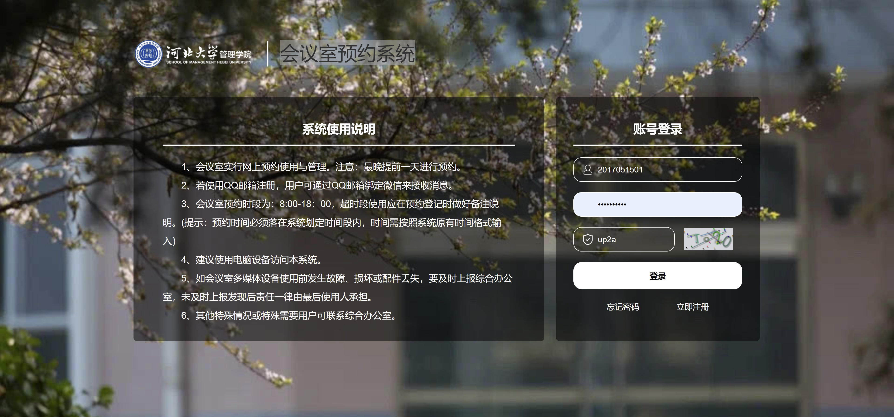
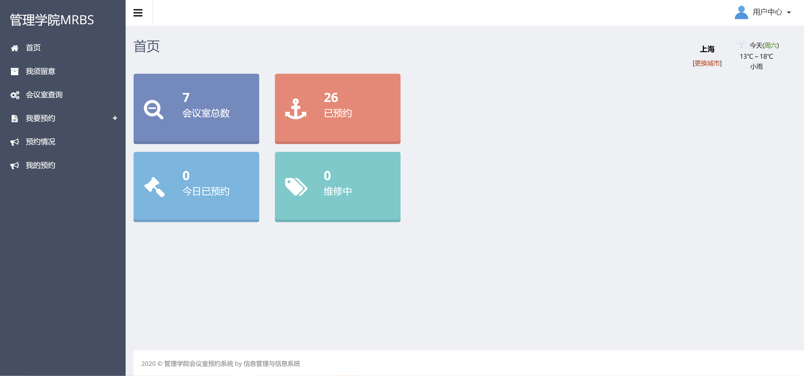
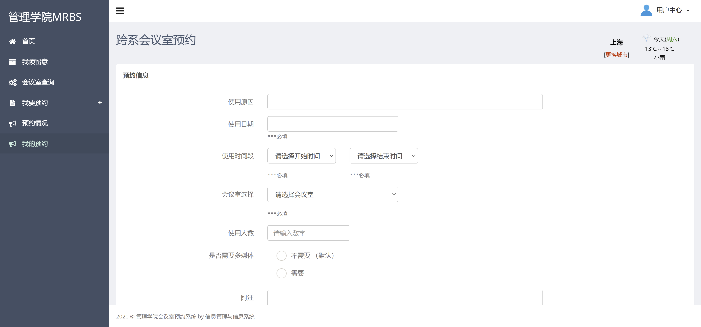
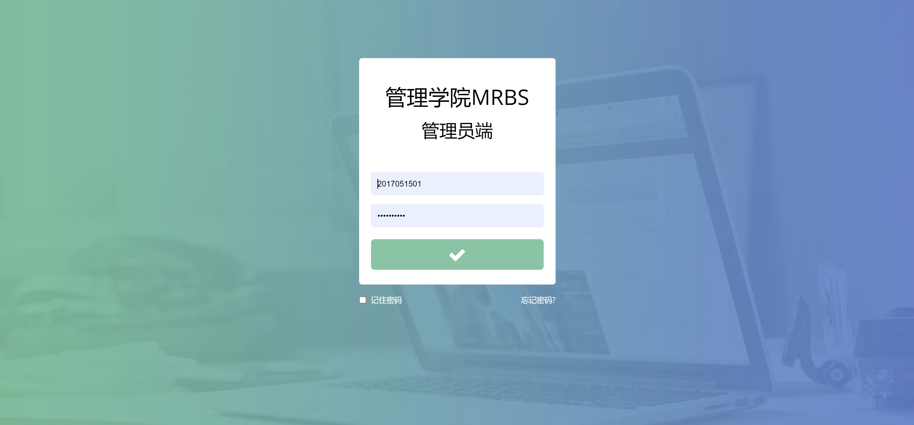
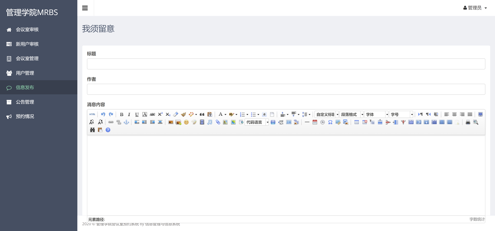

<h1 align="center">会议室预约管理系统</h1>

## 简介
会议室预约管理系统：角色分为管理员、用户；功能包括会议室查询、预约管理、信息发布、用户管理，支持多媒体设备需求，提供简洁直观的用户界面。    --计算机毕业设计源码；毕设源码；java毕业设计源码

## 联系方式

<h3 align="center">获取完整代码与数据库文件 + 微信：deepguan QQ: 86050149 QQ群: 783742310</h3>

<h3 align="center">可帮忙远程部署 包运行成功！提供远程部署、修改代码、设计文档指导、代码讲解等服务！</h3>

## 功能介绍（完整见运行截图）
管理员：登录、注册、会议信息发布与管理、会议室与用户审核及管理、查看和管理预约情况、查看反馈意见、管理公告信息、查看天气信息和个人信息。普通用户：登录、注册、会议室预约与查询、查看我的预约、提交意见反馈、查看预约情况、填写预约信息表单，包括使用原因、日期、时间段、会议室选择、使用人数及多媒体设备需求，查看天气信息和个人信息。

## 运行截图

本代码来源于网络,仅供学习参考使用!

